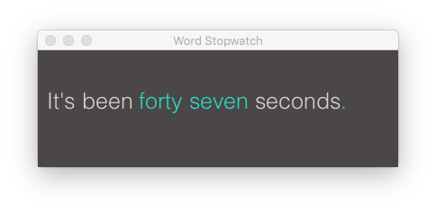
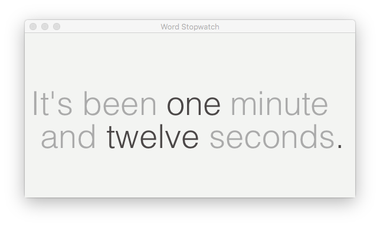
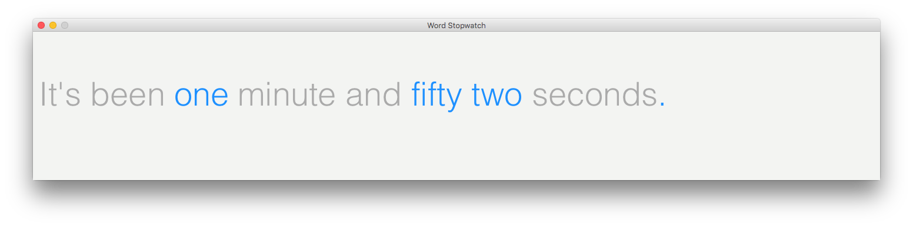
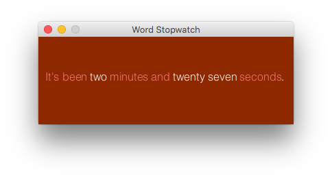
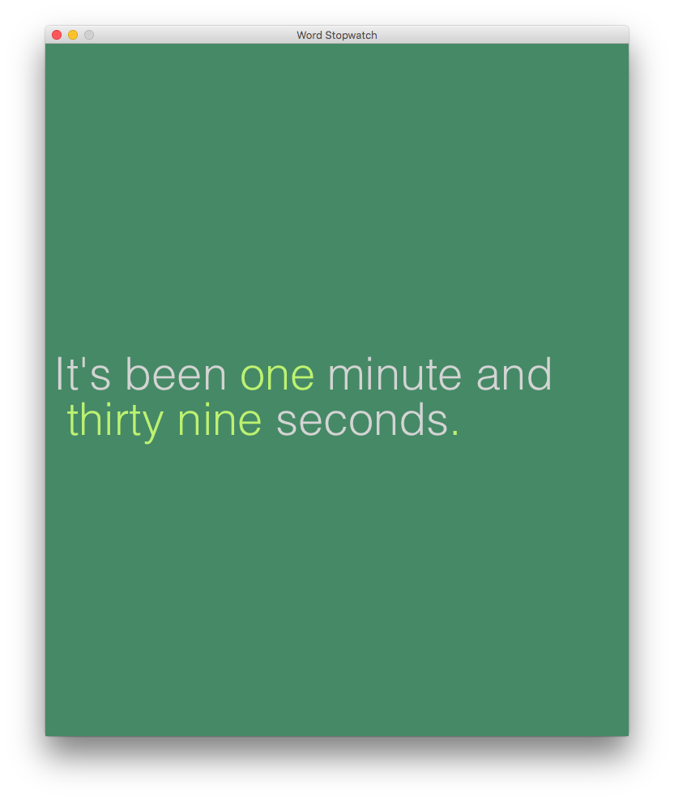
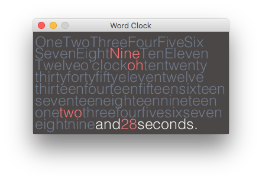

#Word Stopwatch

### by [Mitchell Griest](mailto:mdgriest@crimson.ua.edu)

Word Stopwatch was created using [Processing 3](https://processing.org/).

It's a simple application that displays the passage of time using words rather than numbers.

## Getting Started

The sketch can be run from Processing directly or by running the appropriate application file for your operating system.

To run Word Stopwatch, you will need to have Java 8 installed on your machine. You can download it [here](http://www.oracle.com/technetwork/java/javase/downloads/index.html).

## Pausing and resetting the Stopwatch

You can reset the stopwatch by pressing either the `ENTER` or `BACKSPACE` (`DELETE`) key on your keyboard.

You can reset the stopwatch by simply pressing the spacebar. When you press the spacebar again, things will pick up right where you left off.

## Out-of-the-Box Customization

### Color Scheme

Word Stopwatch comes equipped with six color schemes, which you cycle through using the numbers on your keyboard (1-5, 0 for default).

I have included the hex codes for many colors in the source code, so defining your own color schemes is easy following the style already there. I recommend using [Adobe Kuler](https://color.adobe.com/explore/most-popular/?time=all) or [Paletton](http://paletton.com/#uid=1000u0kllllaFw0g0qFqFg0w0aF) for help finding great color combinations.

### Resizable

The stopwatch is resizable, so make it big and bold or small and out of the way!

### Font Size

You can also increase and decrease the size of the font by using the `]` and `[` keys, respectively.

## Feel free to alter the code to your taste

I have included a few notes where I anticipate you may want to make changes. For example, if you prefer a different typeface, color scheme, or default size for the stopwatch, just update the appropriate lines in the sketch (`worStopWatch.pde`)

## Have fun!

If you enjoy the Word Stopwatch, you might also like my [Word Clock](https://github.com/mdgriest/Word-Clock). Both applications are free and the source code is publicly available on [GitHub](https://github.com/mdgriest).

Best,

Mitchell Griest
